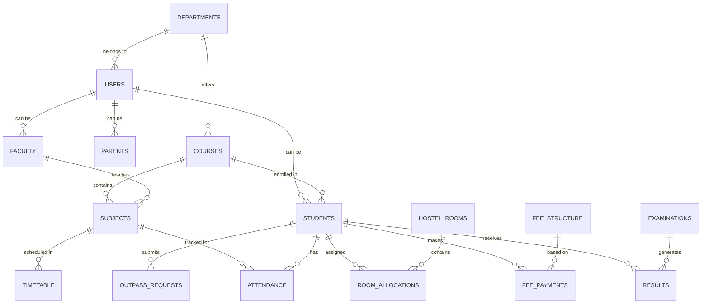

# University Hub - Complete Database Schema

## Overview

This document provides the complete database schema for the University Hub system using Supabase (PostgreSQL) with detailed relationships, indexes, and triggers.

## Entity Relationship Diagram



## Complete Database Schema

### 1. Authentication & Users

```sql
-- Enable UUID extension
CREATE EXTENSION IF NOT EXISTS "uuid-ossp";

-- Users table (extends Supabase auth.users)
CREATE TABLE public.users (
  id UUID REFERENCES auth.users(id) ON DELETE CASCADE PRIMARY KEY,
  email TEXT UNIQUE NOT NULL,
  full_name TEXT NOT NULL,
  role TEXT NOT NULL CHECK (role IN ('super_admin', 'admin', 'faculty', 'student', 'parent', 'staff')),
  department_id UUID REFERENCES departments(id) ON DELETE SET NULL,
  phone TEXT,
  alternate_phone TEXT,
  avatar_url TEXT,
  date_of_birth DATE,
  gender TEXT CHECK (gender IN ('male', 'female', 'other')),
  nationality TEXT DEFAULT 'Indian',
  is_active BOOLEAN DEFAULT true,
  last_login TIMESTAMPTZ,
  metadata JSONB DEFAULT '{}',
  created_at TIMESTAMPTZ DEFAULT NOW(),
  updated_at TIMESTAMPTZ DEFAULT NOW()
);

-- Create indexes
CREATE INDEX idx_users_email ON users(email);
CREATE INDEX idx_users_role ON users(role);
CREATE INDEX idx_users_department ON users(department_id);

-- Update trigger for updated_at
CREATE OR REPLACE FUNCTION update_updated_at_column()
RETURNS TRIGGER AS $$
BEGIN
  NEW.updated_at = NOW();
  RETURN NEW;
END;
$$ language 'plpgsql';

CREATE TRIGGER update_users_updated_at BEFORE UPDATE
  ON users FOR EACH ROW EXECUTE PROCEDURE update_updated_at_column();
```

### 2. Academic Structure

```sql
-- Universities (for multi-tenant support)
CREATE TABLE universities (
  id UUID DEFAULT gen_random_uuid() PRIMARY KEY,
  name TEXT NOT NULL,
  code TEXT UNIQUE NOT NULL,
  address JSONB NOT NULL,
  contact_info JSONB NOT NULL,
  logo_url TEXT,
  website TEXT,
  established_date DATE,
  accreditation JSONB,
  is_active BOOLEAN DEFAULT true,
  created_at TIMESTAMPTZ DEFAULT NOW(),
  updated_at TIMESTAMPTZ DEFAULT NOW()
);

-- Departments
CREATE TABLE departments (
  id UUID DEFAULT gen_random_uuid() PRIMARY KEY,
  university_id UUID REFERENCES universities(id) ON DELETE CASCADE,
  name TEXT NOT NULL,
  code TEXT NOT NULL,
  head_id UUID REFERENCES users(id) ON DELETE SET NULL,
  description TEXT,
  established_date DATE,
  contact_info JSONB,
  is_active BOOLEAN DEFAULT true,
  created_at TIMESTAMPTZ DEFAULT NOW(),
  updated_at TIMESTAMPTZ DEFAULT NOW(),
  UNIQUE(university_id, code)
);

-- Courses/Programs
CREATE TABLE courses (
  id UUID DEFAULT gen_random_uuid() PRIMARY KEY,
  department_id UUID REFERENCES departments(id) ON DELETE CASCADE,
  name TEXT NOT NULL,
  code TEXT NOT NULL,
  degree_type TEXT CHECK (degree_type IN ('bachelor', 'master', 'diploma', 'certificate', 'phd')),
  duration_years DECIMAL(2,1) NOT NULL,
  total_credits INTEGER NOT NULL,
  min_credits_required INTEGER NOT NULL,
  max_intake INTEGER,
  eligibility_criteria JSONB,
  syllabus_url TEXT,
  is_active BOOLEAN DEFAULT true,
  created_at TIMESTAMPTZ DEFAULT NOW(),
  updated_at TIMESTAMPTZ DEFAULT NOW(),
  UNIQUE(department_id, code)
);

-- Academic Years/Sessions
CREATE TABLE academic_sessions (
  id UUID DEFAULT gen_random_uuid() PRIMARY KEY,
  university_id UUID REFERENCES universities(id) ON DELETE CASCADE,
  name TEXT NOT NULL,
  start_date DATE NOT NULL,
  end_date DATE NOT NULL,
  is_current BOOLEAN DEFAULT false,
  created_at TIMESTAMPTZ DEFAULT NOW()
);

-- Semesters
CREATE TABLE semesters (
  id UUID DEFAULT gen_random_uuid() PRIMARY KEY,
  academic_session_id UUID REFERENCES academic_sessions(id) ON DELETE CASCADE,
  name TEXT NOT NULL,
  number INTEGER NOT NULL,
  start_date DATE NOT NULL,
  end_date DATE NOT NULL,
  is_current BOOLEAN DEFAULT false,
  created_at TIMESTAMPTZ DEFAULT NOW()
);

-- Subjects
CREATE TABLE subjects (
  id UUID DEFAULT gen_random_uuid() PRIMARY KEY,
  course_id UUID REFERENCES courses(id) ON DELETE CASCADE,
  name TEXT NOT NULL,
  code TEXT NOT NULL,
  semester INTEGER NOT NULL,
  credits INTEGER NOT NULL,
  type TEXT CHECK (type IN ('core', 'elective', 'practical', 'project')),
  theory_hours INTEGER DEFAULT 0,
  practical_hours INTEGER DEFAULT 0,
  tutorial_hours INTEGER DEFAULT 0,
  syllabus JSONB,
  prerequisites UUID[],
  is_active BOOLEAN DEFAULT true,
  created_at TIMESTAMPTZ DEFAULT NOW(),
  updated_at TIMESTAMPTZ DEFAULT NOW(),
  UNIQUE(course_id, code)
);

-- Subject Faculty Mapping
CREATE TABLE subject_faculty (
  id UUID DEFAULT gen_random_uuid() PRIMARY KEY,
  subject_id UUID REFERENCES subjects(id) ON DELETE CASCADE,
  faculty_id UUID REFERENCES users(id) ON DELETE CASCADE,
  semester_id UUID REFERENCES semesters(id) ON DELETE CASCADE,
  is_primary BOOLEAN DEFAULT false,
  created_at TIMESTAMPTZ DEFAULT NOW(),
  UNIQUE(subject_id, faculty_id, semester_id)
);
```

### 3. User Types

```sql
-- Students
CREATE TABLE students (
  id UUID REFERENCES users(id) ON DELETE CASCADE PRIMARY KEY,
  student_id TEXT UNIQUE NOT NULL,
  course_id UUID REFERENCES courses(id),
  batch_year INTEGER NOT NULL,
  semester INTEGER DEFAULT 1,
  section TEXT,
  roll_number TEXT,
  admission_date DATE NOT NULL,
  admission_type TEXT CHECK (admission_type IN ('regular', 'lateral', 'transfer')),
  admission_category TEXT,
  parent_id UUID REFERENCES users(id) ON DELETE SET NULL,
  guardian_info JSONB,
  permanent_address JSONB NOT NULL,
  current_address JSONB,
  blood_group TEXT,
  medical_info JSONB,
  emergency_contacts JSONB NOT NULL,
  previous_education JSONB,
  documents JSONB,
  is_hosteller BOOLEAN DEFAULT false,
  transport_opted BOOLEAN DEFAULT false,
  created_at TIMESTAMPTZ DEFAULT NOW(),
  updated_at TIMESTAMPTZ DEFAULT NOW()
);

-- Faculty
CREATE TABLE faculty (
  id UUID REFERENCES users(id) ON DELETE CASCADE PRIMARY KEY,
  employee_id TEXT UNIQUE NOT NULL,
  designation TEXT NOT NULL,
  qualification JSONB NOT NULL,
  specialization TEXT[],
  experience_years DECIMAL(3,1),
  join_date DATE NOT NULL,
  teaching_subjects UUID[],
  research_interests TEXT[],
  publications JSONB,
  office_location TEXT,
  consultation_hours JSONB,
  is_permanent BOOLEAN DEFAULT true,
  salary_grade TEXT,
  created_at TIMESTAMPTZ DEFAULT NOW(),
  updated_at TIMESTAMPTZ DEFAULT NOW()
);

-- Parents
CREATE TABLE parents (
  id UUID REFERENCES users(id) ON DELETE CASCADE PRIMARY KEY,
  occupation TEXT,
  organization TEXT,
  annual_income TEXT,
  education_level TEXT,
  relationship TEXT CHECK (relationship IN ('father', 'mother', 'guardian')),
  created_at TIMESTAMPTZ DEFAULT NOW()
);

-- Staff
CREATE TABLE staff (
  id UUID REFERENCES users(id) ON DELETE CASCADE PRIMARY KEY,
  employee_id TEXT UNIQUE NOT NULL,
  designation TEXT NOT NULL,
  staff_type TEXT CHECK (staff_type IN ('administrative', 'technical', 'support')),
  join_date DATE NOT NULL,
  reporting_to UUID REFERENCES users(id),
  created_at TIMESTAMPTZ DEFAULT NOW()
);
```

### 4. Attendance Management

```sql
-- Attendance Sessions
CREATE TABLE attendance_sessions (
  id UUID DEFAULT gen_random_uuid() PRIMARY KEY,
  subject_id UUID REFERENCES subjects(id) ON DELETE CASCADE,
  faculty_id UUID REFERENCES faculty(id) ON DELETE CASCADE,
  session_date DATE NOT NULL,
  start_time TIME NOT NULL,
  end_time TIME NOT NULL,
  session_type TEXT CHECK (session_type IN ('theory', 'practical', 'tutorial')),
  room_number TEXT,
  created_at TIMESTAMPTZ DEFAULT NOW(),
  UNIQUE(subject_id, session_date, start_time)
);

-- Attendance Records
CREATE TABLE attendance (
  id UUID DEFAULT gen_random_uuid() PRIMARY KEY,
  session_id UUID REFERENCES attendance_sessions(id) ON DELETE CASCADE,
  student_id UUID REFERENCES students(id) ON DELETE CASCADE,
  status TEXT NOT NULL CHECK (status IN ('present', 'absent', 'late', 'excused', 'holiday')),
  check_in_time TIMESTAMPTZ,
  check_out_time TIMESTAMPTZ,
  marked_by UUID REFERENCES users(id),
  remarks TEXT,
  created_at TIMESTAMPTZ DEFAULT NOW(),
  updated_at TIMESTAMPTZ DEFAULT NOW(),
  UNIQUE(session_id, student_id)
);

-- Leave Applications
CREATE TABLE leave_applications (
  id UUID DEFAULT gen_random_uuid() PRIMARY KEY,
  student_id UUID REFERENCES students(id) ON DELETE CASCADE,
  leave_type TEXT CHECK (leave_type IN ('sick', 'personal', 'emergency', 'academic')),
  from_date DATE NOT NULL,
  to_date DATE NOT NULL,
  reason TEXT NOT NULL,
  supporting_documents JSONB,
  status TEXT DEFAULT 'pending' CHECK (status IN ('pending', 'approved', 'rejected', 'cancelled')),
  approved_by UUID REFERENCES users(id),
  approval_date TIMESTAMPTZ,
  remarks TEXT,
  created_at TIMESTAMPTZ DEFAULT NOW()
);
```

### 5. Examination Management

```sql
-- Examination Types
CREATE TABLE examination_types (
  id UUID DEFAULT gen_random_uuid() PRIMARY KEY,
  name TEXT NOT NULL,
  code TEXT UNIQUE NOT NULL,
  weightage DECIMAL(5,2),
  created_at TIMESTAMPTZ DEFAULT NOW()
);

-- Examinations
CREATE TABLE examinations (
  id UUID DEFAULT gen_random_uuid() PRIMARY KEY,
  name TEXT NOT NULL,
  examination_type_id UUID REFERENCES examination_types(id),
  semester_id UUID REFERENCES semesters(id) ON DELETE CASCADE,
  start_date DATE NOT NULL,
  end_date DATE NOT NULL,
  result_declaration_date DATE,
  is_published BOOLEAN DEFAULT false,
  created_at TIMESTAMPTZ DEFAULT NOW()
);

-- Exam Schedule
CREATE TABLE exam_schedule (
  id UUID DEFAULT gen_random_uuid() PRIMARY KEY,
  examination_id UUID REFERENCES examinations(id) ON DELETE CASCADE,
  subject_id UUID REFERENCES subjects(id) ON DELETE CASCADE,
  exam_date DATE NOT NULL,
  start_time TIME NOT NULL,
  end_time TIME NOT NULL,
  venue TEXT,
  max_marks DECIMAL(5,2) NOT NULL,
  passing_marks DECIMAL(5,2) NOT NULL,
  instructions TEXT,
  created_at TIMESTAMPTZ DEFAULT NOW(),
  UNIQUE(examination_id, subject_id)
);

-- Results
CREATE TABLE results (
  id UUID DEFAULT gen_random_uuid() PRIMARY KEY,
  student_id UUID REFERENCES students(id) ON DELETE CASCADE,
  exam_schedule_id UUID REFERENCES exam_schedule(id) ON DELETE CASCADE,
  marks_obtained DECIMAL(5,2),
  grade TEXT,
  grade_points DECIMAL(3,2),
  status TEXT CHECK (status IN ('pass', 'fail', 'absent', 'malpractice', 'pending')),
  is_supplementary BOOLEAN DEFAULT false,
  evaluated_by UUID REFERENCES faculty(id),
  evaluation_date DATE,
  remarks TEXT,
  created_at TIMESTAMPTZ DEFAULT NOW(),
  updated_at TIMESTAMPTZ DEFAULT NOW(),
  UNIQUE(student_id, exam_schedule_id)
);

-- Grade System
CREATE TABLE grade_system (
  id UUID DEFAULT gen_random_uuid() PRIMARY KEY,
  university_id UUID REFERENCES universities(id) ON DELETE CASCADE,
  min_marks DECIMAL(5,2) NOT NULL,
  max_marks DECIMAL(5,2) NOT NULL,
  grade TEXT NOT NULL,
  grade_points DECIMAL(3,2) NOT NULL,
  description TEXT,
  created_at TIMESTAMPTZ DEFAULT NOW()
);
```

### 6. Fee Management

```sql
-- Fee Categories
CREATE TABLE fee_categories (
  id UUID DEFAULT gen_random_uuid() PRIMARY KEY,
  name TEXT NOT NULL,
  code TEXT UNIQUE NOT NULL,
  description TEXT,
  is_refundable BOOLEAN DEFAULT false,
  created_at TIMESTAMPTZ DEFAULT NOW()
);

-- Fee Structure
CREATE TABLE fee_structure (
  id UUID DEFAULT gen_random_uuid() PRIMARY KEY,
  course_id UUID REFERENCES courses(id) ON DELETE CASCADE,
  academic_session_id UUID REFERENCES academic_sessions(id) ON DELETE CASCADE,
  semester INTEGER,
  fee_category_id UUID REFERENCES fee_categories(id),
  amount DECIMAL(10,2) NOT NULL,
  due_date DATE,
  late_fee_per_day DECIMAL(10,2) DEFAULT 0,
  max_late_fee DECIMAL(10,2),
  created_at TIMESTAMPTZ DEFAULT NOW(),
  UNIQUE(course_id, academic_session_id, semester, fee_category_id)
);

-- Fee Payments
CREATE TABLE fee_payments (
  id UUID DEFAULT gen_random_uuid() PRIMARY KEY,
  student_id UUID REFERENCES students(id) ON DELETE CASCADE,
  fee_structure_id UUID REFERENCES fee_structure(id),
  amount_due DECIMAL(10,2) NOT NULL,
  amount_paid DECIMAL(10,2) NOT NULL,
  late_fee DECIMAL(10,2) DEFAULT 0,
  payment_date TIMESTAMPTZ NOT NULL,
  payment_mode TEXT CHECK (payment_mode IN ('online', 'cash', 'cheque', 'dd', 'bank_transfer')),
  transaction_id TEXT,
  receipt_number TEXT UNIQUE,
  status TEXT CHECK (status IN ('pending', 'completed', 'failed', 'refunded', 'partial')),
  remarks TEXT,
  processed_by UUID REFERENCES users(id),
  created_at TIMESTAMPTZ DEFAULT NOW()
);

-- Scholarships
CREATE TABLE scholarships (
  id UUID DEFAULT gen_random_uuid() PRIMARY KEY,
  name TEXT NOT NULL,
  description TEXT,
  eligibility_criteria JSONB,
  amount DECIMAL(10,2),
  percentage DECIMAL(5,2),
  valid_from DATE,
  valid_to DATE,
  created_at TIMESTAMPTZ DEFAULT NOW()
);

-- Student Scholarships
CREATE TABLE student_scholarships (
  id UUID DEFAULT gen_random_uuid() PRIMARY KEY,
  student_id UUID REFERENCES students(id) ON DELETE CASCADE,
  scholarship_id UUID REFERENCES scholarships(id),
  academic_session_id UUID REFERENCES academic_sessions(id),
  amount_sanctioned DECIMAL(10,2),
  status TEXT CHECK (status IN ('applied', 'approved', 'rejected', 'disbursed')),
  approved_by UUID REFERENCES users(id),
  approval_date DATE,
  created_at TIMESTAMPTZ DEFAULT NOW()
);
```

### 7. Out-Pass Management

```sql
-- Out-Pass Types
CREATE TABLE outpass_types (
  id UUID DEFAULT gen_random_uuid() PRIMARY KEY,
  name TEXT NOT NULL,
  code TEXT UNIQUE NOT NULL,
  max_duration_hours INTEGER,
  requires_parent_approval BOOLEAN DEFAULT false,
  created_at TIMESTAMPTZ DEFAULT NOW()
);

-- Out-Pass Requests
CREATE TABLE outpass_requests (
  id UUID DEFAULT gen_random_uuid() PRIMARY KEY,
  student_id UUID REFERENCES students(id) ON DELETE CASCADE,
  outpass_type_id UUID REFERENCES outpass_types(id),
  purpose TEXT NOT NULL,
  destination TEXT NOT NULL,
  from_datetime TIMESTAMPTZ NOT NULL,
  to_datetime TIMESTAMPTZ NOT NULL,
  contact_during_leave TEXT NOT NULL,
  accompanied_by TEXT,
  status TEXT DEFAULT 'pending' CHECK (status IN ('pending', 'approved', 'rejected', 'cancelled', 'expired')),
  warden_approval_status TEXT CHECK (warden_approval_status IN ('pending', 'approved', 'rejected')),
  warden_approved_by UUID REFERENCES users(id),
  warden_approval_date TIMESTAMPTZ,
  hod_approval_status TEXT CHECK (hod_approval_status IN ('pending', 'approved', 'rejected')),
  hod_approved_by UUID REFERENCES users(id),
  hod_approval_date TIMESTAMPTZ,
  parent_notified BOOLEAN DEFAULT false,
  parent_notified_at TIMESTAMPTZ,
  actual_out_time TIMESTAMPTZ,
  actual_in_time TIMESTAMPTZ,
  late_return_reason TEXT,
  remarks TEXT,
  created_at TIMESTAMPTZ DEFAULT NOW()
);

-- Out-Pass History
CREATE TABLE outpass_history (
  id UUID DEFAULT gen_random_uuid() PRIMARY KEY,
  outpass_request_id UUID REFERENCES outpass_requests(id) ON DELETE CASCADE,
  action TEXT NOT NULL,
  performed_by UUID REFERENCES users(id),
  performed_at TIMESTAMPTZ DEFAULT NOW(),
  remarks TEXT
);
```

### 8. Hostel Management

```sql
-- Hostel Buildings
CREATE TABLE hostel_buildings (
  id UUID DEFAULT gen_random_uuid() PRIMARY KEY,
  name TEXT NOT NULL,
  code TEXT UNIQUE NOT NULL,
  type TEXT CHECK (type IN ('boys', 'girls', 'staff')),
  total_floors INTEGER NOT NULL,
  total_rooms INTEGER NOT NULL,
  warden_id UUID REFERENCES users(id),
  amenities JSONB,
  rules JSONB,
  created_at TIMESTAMPTZ DEFAULT NOW()
);

-- Hostel Rooms
CREATE TABLE hostel_rooms (
  id UUID DEFAULT gen_random_uuid() PRIMARY KEY,
  building_id UUID REFERENCES hostel_buildings(id) ON DELETE CASCADE,
  floor INTEGER NOT NULL,
  room_number TEXT NOT NULL,
  room_type TEXT CHECK (room_type IN ('single', 'double', 'triple', 'dormitory')),
  capacity INTEGER NOT NULL,
  current_occupancy INTEGER DEFAULT 0 CHECK (current_occupancy <= capacity),
  fee_per_semester DECIMAL(10,2),
  amenities JSONB,
  is_available BOOLEAN DEFAULT true,
  created_at TIMESTAMPTZ DEFAULT NOW(),
  UNIQUE(building_id, room_number)
);

-- Room Allocations
CREATE TABLE room_allocations (
  id UUID DEFAULT gen_random_uuid() PRIMARY KEY,
  student_id UUID REFERENCES students(id) ON DELETE CASCADE,
  room_id UUID REFERENCES hostel_rooms(id) ON DELETE CASCADE,
  academic_session_id UUID REFERENCES academic_sessions(id),
  allocated_date DATE NOT NULL,
  vacated_date DATE,
  bed_number TEXT,
  is_active BOOLEAN DEFAULT true,
  created_at TIMESTAMPTZ DEFAULT NOW(),
  UNIQUE(student_id, academic_session_id)
);

-- Hostel Complaints
CREATE TABLE hostel_complaints (
  id UUID DEFAULT gen_random_uuid() PRIMARY KEY,
  student_id UUID REFERENCES students(id) ON DELETE CASCADE,
  room_id UUID REFERENCES hostel_rooms(id),
  category TEXT CHECK (category IN ('maintenance', 'cleanliness', 'food', 'security', 'other')),
  description TEXT NOT NULL,
  priority TEXT CHECK (priority IN ('low', 'medium', 'high', 'urgent')),
  status TEXT DEFAULT 'open' CHECK (status IN ('open', 'in_progress', 'resolved', 'closed')),
  assigned_to UUID REFERENCES users(id),
  resolved_date TIMESTAMPTZ,
  resolution_notes TEXT,
  created_at TIMESTAMPTZ DEFAULT NOW()
);

-- Mess Menu
CREATE TABLE mess_menu (
  id UUID DEFAULT gen_random_uuid() PRIMARY KEY,
  building_id UUID REFERENCES hostel_buildings(id) ON DELETE CASCADE,
  day_of_week INTEGER CHECK (day_of_week BETWEEN 0 AND 6),
  meal_type TEXT CHECK (meal_type IN ('breakfast', 'lunch', 'snacks', 'dinner')),
  menu_items JSONB NOT NULL,
  timing_from TIME NOT NULL,
  timing_to TIME NOT NULL,
  is_active BOOLEAN DEFAULT true,
  created_at TIMESTAMPTZ DEFAULT NOW()
);

-- Mess Feedback
CREATE TABLE mess_feedback (
  id UUID DEFAULT gen_random_uuid() PRIMARY KEY,
  student_id UUID REFERENCES students(id) ON DELETE CASCADE,
  meal_date DATE NOT NULL,
  meal_type TEXT CHECK (meal_type IN ('breakfast', 'lunch', 'snacks', 'dinner')),
  rating INTEGER CHECK (rating BETWEEN 1 AND 5),
  feedback TEXT,
  created_at TIMESTAMPTZ DEFAULT NOW()
);
```

### 9. Library Management

```sql
-- Library Resources
CREATE TABLE library_resources (
  id UUID DEFAULT gen_random_uuid() PRIMARY KEY,
  title TEXT NOT NULL,
  type TEXT CHECK (type IN ('book', 'journal', 'magazine', 'newspaper', 'digital', 'thesis')),
  isbn TEXT,
  authors TEXT[],
  publisher TEXT,
  publication_year INTEGER,
  edition TEXT,
  category TEXT,
  subject_tags TEXT[],
  location TEXT,
  total_copies INTEGER DEFAULT 1,
  available_copies INTEGER DEFAULT 1,
  price DECIMAL(10,2),
  is_reference_only BOOLEAN DEFAULT false,
  digital_url TEXT,
  created_at TIMESTAMPTZ DEFAULT NOW()
);

-- Library Transactions
CREATE TABLE library_transactions (
  id UUID DEFAULT gen_random_uuid() PRIMARY KEY,
  resource_id UUID REFERENCES library_resources(id) ON DELETE CASCADE,
  user_id UUID REFERENCES users(id) ON DELETE CASCADE,
  transaction_type TEXT CHECK (transaction_type IN ('issue', 'return', 'renew', 'reserve')),
  issue_date DATE,
  due_date DATE,
  return_date DATE,
  fine_amount DECIMAL(10,2) DEFAULT 0,
  fine_paid BOOLEAN DEFAULT false,
  status TEXT CHECK (status IN ('active', 'returned', 'overdue', 'lost')),
  remarks TEXT,
  created_at TIMESTAMPTZ DEFAULT NOW()
);

-- Library Fines
CREATE TABLE library_fines (
  id UUID DEFAULT gen_random_uuid() PRIMARY KEY,
  transaction_id UUID REFERENCES library_transactions(id) ON DELETE CASCADE,
  fine_amount DECIMAL(10,2) NOT NULL,
  paid_amount DECIMAL(10,2) DEFAULT 0,
  payment_date DATE,
  payment_mode TEXT,
  receipt_number TEXT,
  created_at TIMESTAMPTZ DEFAULT NOW()
);
```

### 10. Placement Management

```sql
-- Companies
CREATE TABLE companies (
  id UUID DEFAULT gen_random_uuid() PRIMARY KEY,
  name TEXT NOT NULL,
  industry TEXT,
  website TEXT,
  contact_person TEXT,
  contact_email TEXT,
  contact_phone TEXT,
  address JSONB,
  company_size TEXT,
  created_at TIMESTAMPTZ DEFAULT NOW()
);

-- Placement Drives
CREATE TABLE placement_drives (
  id UUID DEFAULT gen_random_uuid() PRIMARY KEY,
  company_id UUID REFERENCES companies(id) ON DELETE CASCADE,
  academic_session_id UUID REFERENCES academic_sessions(id),
  drive_date DATE NOT NULL,
  job_profile TEXT NOT NULL,
  job_description TEXT,
  eligibility_criteria JSONB,
  package_details JSONB,
  selection_process JSONB,
  registration_deadline DATE,
  status TEXT CHECK (status IN ('upcoming', 'ongoing', 'completed', 'cancelled')),
  created_at TIMESTAMPTZ DEFAULT NOW()
);

-- Student Placements
CREATE TABLE student_placements (
  id UUID DEFAULT gen_random_uuid() PRIMARY KEY,
  student_id UUID REFERENCES students(id) ON DELETE CASCADE,
  placement_drive_id UUID REFERENCES placement_drives(id) ON DELETE CASCADE,
  registration_date DATE NOT NULL,
  rounds_cleared JSONB,
  final_status TEXT CHECK (final_status IN ('selected', 'rejected', 'in_process', 'withdrawn')),
  offer_letter_date DATE,
  package_offered DECIMAL(10,2),
  joining_date DATE,
  created_at TIMESTAMPTZ DEFAULT NOW()
);
```

### 11. Notifications & Communications

```sql
-- Notifications
CREATE TABLE notifications (
  id UUID DEFAULT gen_random_uuid() PRIMARY KEY,
  user_id UUID REFERENCES users(id) ON DELETE CASCADE,
  title TEXT NOT NULL,
  message TEXT NOT NULL,
  type TEXT CHECK (type IN ('info', 'warning', 'error', 'success')),
  category TEXT,
  action_url TEXT,
  is_read BOOLEAN DEFAULT false,
  read_at TIMESTAMPTZ,
  created_at TIMESTAMPTZ DEFAULT NOW()
);

-- Announcements
CREATE TABLE announcements (
  id UUID DEFAULT gen_random_uuid() PRIMARY KEY,
  title TEXT NOT NULL,
  content TEXT NOT NULL,
  announcement_type TEXT CHECK (announcement_type IN ('general', 'academic', 'examination', 'event', 'urgent')),
  target_audience TEXT[] CHECK (target_audience <@ ARRAY['all', 'students', 'faculty', 'staff', 'parents']),
  specific_departments UUID[],
  specific_courses UUID[],
  attachments JSONB,
  is_active BOOLEAN DEFAULT true,
  display_from DATE,
  display_until DATE,
  created_by UUID REFERENCES users(id),
  created_at TIMESTAMPTZ DEFAULT NOW()
);

-- Messages
CREATE TABLE messages (
  id UUID DEFAULT gen_random_uuid() PRIMARY KEY,
  sender_id UUID REFERENCES users(id) ON DELETE CASCADE,
  recipient_id UUID REFERENCES users(id) ON DELETE CASCADE,
  subject TEXT,
  content TEXT NOT NULL,
  is_read BOOLEAN DEFAULT false,
  read_at TIMESTAMPTZ,
  parent_message_id UUID REFERENCES messages(id),
  attachments JSONB,
  created_at TIMESTAMPTZ DEFAULT NOW()
);
```

### 12. Audit & Logs

```sql
-- Audit Logs
CREATE TABLE audit_logs (
  id UUID DEFAULT gen_random_uuid() PRIMARY KEY,
  user_id UUID REFERENCES users(id),
  action TEXT NOT NULL,
  entity_type TEXT NOT NULL,
  entity_id UUID,
  old_values JSONB,
  new_values JSONB,
  ip_address INET,
  user_agent TEXT,
  created_at TIMESTAMPTZ DEFAULT NOW()
);

-- Login History
CREATE TABLE login_history (
  id UUID DEFAULT gen_random_uuid() PRIMARY KEY,
  user_id UUID REFERENCES users(id) ON DELETE CASCADE,
  login_time TIMESTAMPTZ NOT NULL,
  logout_time TIMESTAMPTZ,
  ip_address INET,
  user_agent TEXT,
  location JSONB,
  device_info JSONB,
  session_duration INTERVAL,
  created_at TIMESTAMPTZ DEFAULT NOW()
);
```

## Indexes for Performance

```sql
-- User related indexes
CREATE INDEX idx_users_active ON users(is_active) WHERE is_active = true;
CREATE INDEX idx_students_course ON students(course_id);
CREATE INDEX idx_students_batch ON students(batch_year);
CREATE INDEX idx_faculty_department ON faculty(id, designation);

-- Attendance indexes
CREATE INDEX idx_attendance_student_date ON attendance(student_id, created_at);
CREATE INDEX idx_attendance_session ON attendance(session_id);
CREATE INDEX idx_attendance_status ON attendance(status);

-- Results indexes
CREATE INDEX idx_results_student ON results(student_id);
CREATE INDEX idx_results_exam ON results(exam_schedule_id);

-- Fee indexes
CREATE INDEX idx_fee_payments_student ON fee_payments(student_id);
CREATE INDEX idx_fee_payments_status ON fee_payments(status);
CREATE INDEX idx_fee_payments_date ON fee_payments(payment_date);

-- Outpass indexes
CREATE INDEX idx_outpass_student ON outpass_requests(student_id);
CREATE INDEX idx_outpass_status ON outpass_requests(status);
CREATE INDEX idx_outpass_dates ON outpass_requests(from_datetime, to_datetime);

-- Notification indexes
CREATE INDEX idx_notifications_user_unread ON notifications(user_id, is_read) WHERE is_read = false;
```

## Row Level Security Policies

```sql
-- Enable RLS on all tables
ALTER TABLE users ENABLE ROW LEVEL SECURITY;
ALTER TABLE students ENABLE ROW LEVEL SECURITY;
ALTER TABLE faculty ENABLE ROW LEVEL SECURITY;
ALTER TABLE attendance ENABLE ROW LEVEL SECURITY;
ALTER TABLE results ENABLE ROW LEVEL SECURITY;
ALTER TABLE fee_payments ENABLE ROW LEVEL SECURITY;
ALTER TABLE outpass_requests ENABLE ROW LEVEL SECURITY;
-- Enable for all other tables...

-- Example RLS Policies

-- Students can view their own data
CREATE POLICY "Students view own data" ON students
  FOR SELECT USING (auth.uid() = id);

-- Faculty can view students in their department
CREATE POLICY "Faculty view department students" ON students
  FOR SELECT USING (
    EXISTS (
      SELECT 1 FROM users u
      JOIN courses c ON c.department_id = u.department_id
      WHERE u.id = auth.uid()
      AND u.role = 'faculty'
      AND students.course_id = c.id
    )
  );

-- Admins can view all data
CREATE POLICY "Admins full access" ON students
  FOR ALL USING (
    EXISTS (
      SELECT 1 FROM users
      WHERE id = auth.uid()
      AND role IN ('admin', 'super_admin')
    )
  );

-- Students can view their own attendance
CREATE POLICY "Students view own attendance" ON attendance
  FOR SELECT USING (student_id = auth.uid());

-- Faculty can manage attendance for their subjects
CREATE POLICY "Faculty manage subject attendance" ON attendance
  FOR ALL USING (
    EXISTS (
      SELECT 1 FROM subject_faculty sf
      JOIN attendance_sessions ats ON ats.subject_id = sf.subject_id
      WHERE sf.faculty_id = auth.uid()
      AND attendance.session_id = ats.id
    )
  );
```

## Functions and Triggers

```sql
-- Auto-update room occupancy
CREATE OR REPLACE FUNCTION update_room_occupancy()
RETURNS TRIGGER AS $$
BEGIN
  IF TG_OP = 'INSERT' THEN
    UPDATE hostel_rooms
    SET current_occupancy = current_occupancy + 1
    WHERE id = NEW.room_id;
  ELSIF TG_OP = 'DELETE' OR (TG_OP = 'UPDATE' AND NEW.is_active = false AND OLD.is_active = true) THEN
    UPDATE hostel_rooms
    SET current_occupancy = current_occupancy - 1
    WHERE id = OLD.room_id;
  END IF;
  RETURN NEW;
END;
$$ LANGUAGE plpgsql;

CREATE TRIGGER trigger_update_room_occupancy
AFTER INSERT OR UPDATE OR DELETE ON room_allocations
FOR EACH ROW EXECUTE FUNCTION update_room_occupancy();

-- Calculate SGPA
CREATE OR REPLACE FUNCTION calculate_sgpa(p_student_id UUID, p_semester_id UUID)
RETURNS DECIMAL AS $$
DECLARE
  v_sgpa DECIMAL(3,2);
BEGIN
  SELECT
    SUM(s.credits * r.grade_points) / SUM(s.credits)
  INTO v_sgpa
  FROM results r
  JOIN exam_schedule es ON es.id = r.exam_schedule_id
  JOIN subjects s ON s.id = es.subject_id
  JOIN examinations e ON e.id = es.examination_id
  WHERE r.student_id = p_student_id
  AND e.semester_id = p_semester_id
  AND r.status = 'pass';

  RETURN COALESCE(v_sgpa, 0);
END;
$$ LANGUAGE plpgsql;

-- Calculate attendance percentage
CREATE OR REPLACE FUNCTION calculate_attendance_percentage(
  p_student_id UUID,
  p_subject_id UUID,
  p_from_date DATE DEFAULT NULL,
  p_to_date DATE DEFAULT NULL
)
RETURNS DECIMAL AS $$
DECLARE
  v_total_sessions INTEGER;
  v_attended_sessions INTEGER;
  v_percentage DECIMAL(5,2);
BEGIN
  -- Count total sessions
  SELECT COUNT(*)
  INTO v_total_sessions
  FROM attendance_sessions ats
  JOIN attendance a ON a.session_id = ats.id
  WHERE ats.subject_id = p_subject_id
  AND a.student_id = p_student_id
  AND (p_from_date IS NULL OR ats.session_date >= p_from_date)
  AND (p_to_date IS NULL OR ats.session_date <= p_to_date);

  -- Count attended sessions
  SELECT COUNT(*)
  INTO v_attended_sessions
  FROM attendance_sessions ats
  JOIN attendance a ON a.session_id = ats.id
  WHERE ats.subject_id = p_subject_id
  AND a.student_id = p_student_id
  AND a.status IN ('present', 'late')
  AND (p_from_date IS NULL OR ats.session_date >= p_from_date)
  AND (p_to_date IS NULL OR ats.session_date <= p_to_date);

  IF v_total_sessions = 0 THEN
    RETURN 0;
  END IF;

  v_percentage := (v_attended_sessions::DECIMAL / v_total_sessions) * 100;

  RETURN ROUND(v_percentage, 2);
END;
$$ LANGUAGE plpgsql;
```

## Views for Common Queries

```sql
-- Student Dashboard View
CREATE VIEW student_dashboard AS
SELECT
  s.id,
  s.student_id,
  u.full_name,
  u.email,
  c.name as course_name,
  d.name as department_name,
  s.semester,
  s.batch_year,
  calculate_sgpa(s.id, current_semester_id()) as current_sgpa,
  (
    SELECT COUNT(*)
    FROM outpass_requests
    WHERE student_id = s.id
    AND status = 'approved'
    AND from_datetime >= NOW() - INTERVAL '30 days'
  ) as recent_outpasses,
  (
    SELECT SUM(amount_due - amount_paid)
    FROM fee_payments
    WHERE student_id = s.id
    AND status != 'completed'
  ) as pending_fees
FROM students s
JOIN users u ON u.id = s.id
JOIN courses c ON c.id = s.course_id
JOIN departments d ON d.id = c.department_id;

-- Faculty Workload View
CREATE VIEW faculty_workload AS
SELECT
  f.id,
  f.employee_id,
  u.full_name,
  d.name as department_name,
  COUNT(DISTINCT sf.subject_id) as total_subjects,
  (
    SELECT COUNT(DISTINCT ats.id)
    FROM attendance_sessions ats
    WHERE ats.faculty_id = f.id
    AND ats.session_date >= NOW() - INTERVAL '7 days'
  ) as sessions_this_week,
  (
    SELECT COUNT(DISTINCT s.id)
    FROM students s
    JOIN subject_faculty sf2 ON sf2.faculty_id = f.id
    JOIN subjects sub ON sub.id = sf2.subject_id
    WHERE s.course_id = sub.course_id
  ) as total_students
FROM faculty f
JOIN users u ON u.id = f.id
LEFT JOIN departments d ON d.id = u.department_id
LEFT JOIN subject_faculty sf ON sf.faculty_id = f.id
GROUP BY f.id, f.employee_id, u.full_name, d.name;
```

## Backup and Maintenance

```sql
-- Create backup schema
CREATE SCHEMA IF NOT EXISTS backup;

-- Function to backup critical tables
CREATE OR REPLACE FUNCTION backup_critical_data()
RETURNS void AS $$
BEGIN
  -- Backup results before new semester
  CREATE TABLE IF NOT EXISTS backup.results_backup AS
  SELECT *, NOW() as backup_date FROM results;

  -- Backup fee payments monthly
  CREATE TABLE IF NOT EXISTS backup.fee_payments_backup AS
  SELECT *, NOW() as backup_date FROM fee_payments
  WHERE created_at >= NOW() - INTERVAL '1 month';
END;
$$ LANGUAGE plpgsql;

-- Schedule maintenance
CREATE EXTENSION IF NOT EXISTS pg_cron;

-- Clean old notifications
SELECT cron.schedule('clean-old-notifications', '0 2 * * *', $$
  DELETE FROM notifications
  WHERE created_at < NOW() - INTERVAL '90 days'
  AND is_read = true;
$$);

-- Update attendance statistics
SELECT cron.schedule('update-attendance-stats', '0 3 * * *', $$
  REFRESH MATERIALIZED VIEW CONCURRENTLY attendance_statistics;
$$);
```

This comprehensive database schema provides a solid foundation for the University Hub system with proper relationships, constraints, indexes, and security policies.
